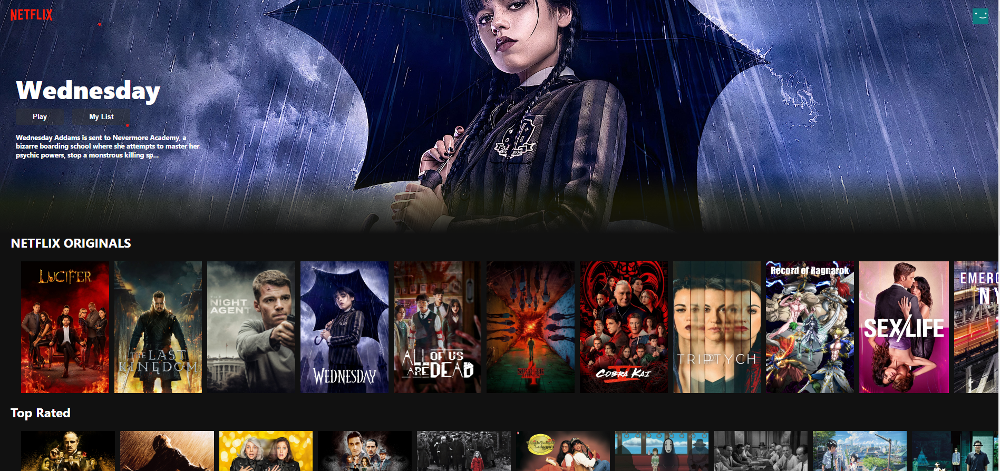

# Netflix Clone

This project is a clone of the popular streaming platform, Netflix, built using React and React-Redux for the frontend, and Google Firebase Store for the backend. The platform also utilizes the TMDB API for fetching the latest and popular movies and shows, and Stripe payment API for secure and efficient payment transactions.

## Live Project Link

The project is hosted on Netlify and can be accessed using the following link - https://netflxx-clone.netlify.app/

## Features

- User authentication and authorization
- Stripe payment integration for subscription-based access
- User-friendly and intuitive interface

## Technologies Used

The following technologies were used in the development of this project:

- ReactJS - A JavaScript library for building user interfaces
- Redux - A predictable state container for JavaScript apps
- Google Firebase Store - A cloud-hosted NoSQL database
- TMDB API - An API for accessing movie and TV show data
- Stripe API - A payment gateway for online transactions

## Setup

To run this project on your local machine, follow the instructions below:

1. Clone the repository: git clone https://github.com/omkar1304/Netflix-Clone-using-React.git

2. Navigate to the project directory: cd Netflix-Clone-using-React

3. Install dependencies: npm install

4. Start the development server: npm start

5. The project should now be running on http://localhost:3000

## Conclusion

The Netflix clone project demonstrates proficiency in React and Redux for the frontend, Google Firebase Store for the backend, and Stripe API for payment integration. The project delivers an intuitive and user-friendly experience to meet diverse user needs.
